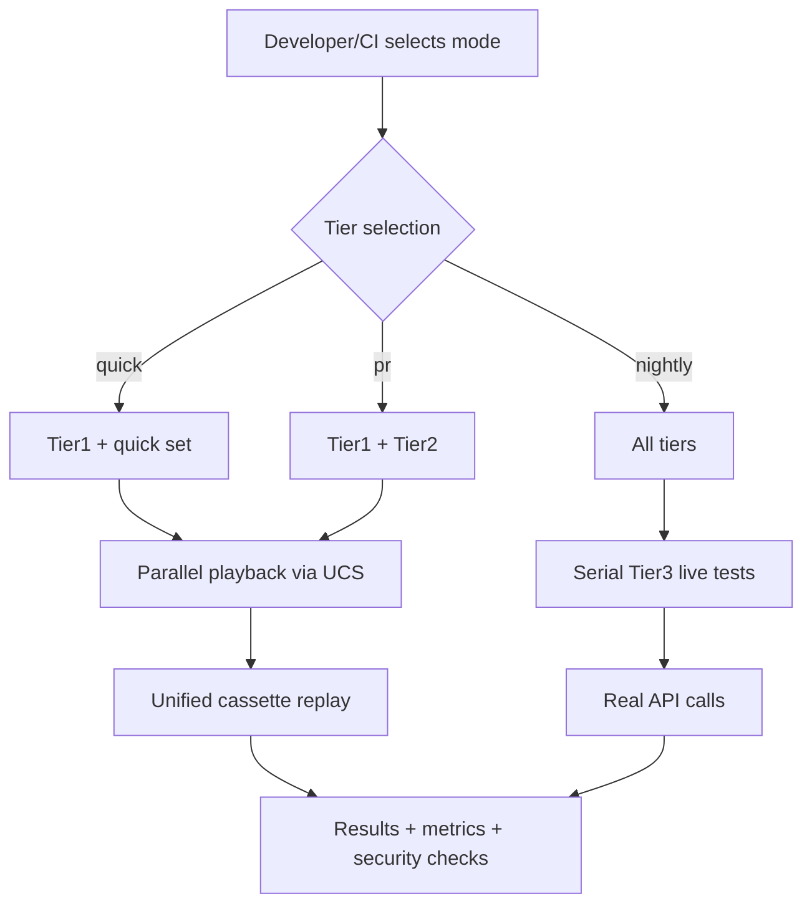

# Design (LLM‑Executable)

This design delivers the system envisioned in *faster_sim.md* using a **Unified Cassette System (UCS)**, parallel playback, and serial recording, while preserving a small set of Tier3 “live spec” flows. It supersedes library‑specific wording in prior docs. fileciteturn0file3 fileciteturn0file1

## Architecture Overview



### Tiers
- **Tier1:** unit, pure logic, no I/O.
- **Tier2:** integration using UCS (deterministic replay).
- **Tier3:** selected “golden path” live calls.

## Unified Cassette System (UCS)

### Goals
- Deterministic, sanitized replays across **requests**, **httpx**, **aiohttp**.  
- Library‑agnostic unified cassette format (YAML/JSON).  
- Transparent backend activation per client in use.

### Backend mapping (canonical)
| Client | Backend | Notes |
|---|---|---|
| `requests` | **responses** or **requests‑mock** | Stable, widely used for `requests`. citeturn0search18turn0search3 |
| `httpx` | **respx** | Built for HTTPX. citeturn0search1turn0search6 |
| `aiohttp` | **aioresponses** | Purpose‑built for aiohttp. citeturn0search2 |

> Prior text mentioned VCR.py as an example; we retain VCR‑style determinism while using UCS to unify client coverage. citeturn0search4turn0search9

### Recording vs Playback
- **Recording mode:** *force serial* (disable xdist, deny worker fan‑out).  
- **Playback mode:** parallel allowed; workflows **grouped** per worker using `@pytest.mark.xdist_group` with `--dist loadgroup`. citeturn0search0turn0search15

### Cassette format (sketch)
```yaml
version: "1.0"
metadata:
  test: "planner_workflow"
  tool: "planner"
  model: "gpt-5"
  prompt_hash: "abc123"
  recorded_at: "2025-08-10T15:30:00Z"
interactions:
  - client: "httpx"
    request: {method: POST, url: "https://api...", headers: {...}, body: ...}
    response: {status: 200, headers: {...}, body: ...}
```

### Matching & Sanitization
- Match on `{method, uri, headers*, body*}` (headers/body matchers configurable).  
- Sanitize auth headers, keys, tokens, PII prior to write.  
- Hash input that affects outputs (prompt/config) into metadata for staleness checks.

## Core Components

### HTTPRecordingManager
- Responsibilities: record/playback orchestration, backend activation, cassette IO, matchers, sanitization, staleness, worker‑scoped paths.  
- Serial‑recording gate: when `RECORD_MODE in {"once","all"}`, **turn off** xdist or exit with guidance. (Aligns with prior requirements.) fileciteturn0file2

### WorkflowTestRunner
- Provides step sequencing + continuation‑ID handling + shared validators.  
- Integrates with HTTPRecordingManager to scope cassettes per test/workflow. fileciteturn0file1

### TestTierManager
- Exposes CLI presets: **quick**, **pr**, **nightly**.  
- Ensures markers (`tier1`,`tier2`,`tier3`,`quick`) are **registered** in `pytest.ini` to avoid UnknownMark warnings. citeturn1search0turn1search1

## Parallel Strategy (Playback)
- Enable pytest‑xdist; use `--dist loadgroup` and `@pytest.mark.xdist_group(name="...")` to keep multi‑step workflows on one worker. citeturn0search0turn0search15
- Isolate per‑worker state (temp dirs, storage, cassette paths).  
- Provide serial fallback on conflicts.

## Security
- Pre‑commit secret scans for cassette files + CI gates.  
- Sanitization hooks executed in record path; blocking on violations.

## Observability
- Emit: per‑test durations, cassette hit/miss, parallel efficiency, and flake signals.  
- Threshold alerts if R1 targets regress. fileciteturn0file1

## CI modes
- **quick:** run 6 curated tests across tools.  
- **pr:** Tier1+Tier2 only, parallel playback.  
- **nightly:** all tiers; Tier3 runs serially at end. fileciteturn0file3

## Migration
- Convert legacy VCR.py assets to UCS; keep determinism. citeturn0search4  
- Provide scripts for re‑record, refresh, and orphan cleanup. fileciteturn0file1

## Risks & Mitigations
- **Mismatch of client backends** → enforce mapping table above. citeturn0search1turn0search2turn0search18turn0search3  
- **Parallel race during record** → serial gate + single‑worker store. fileciteturn0file2
- **Unknown markers** → register markers in `pytest.ini`. citeturn1search0

## Fit to faster_sim.md
All faster_sim goals—speed, three tiers, preserved live spec, determinism, parallelization, and explicit “quick” set—are met with UCS + runner + xdist grouping. fileciteturn0file3
