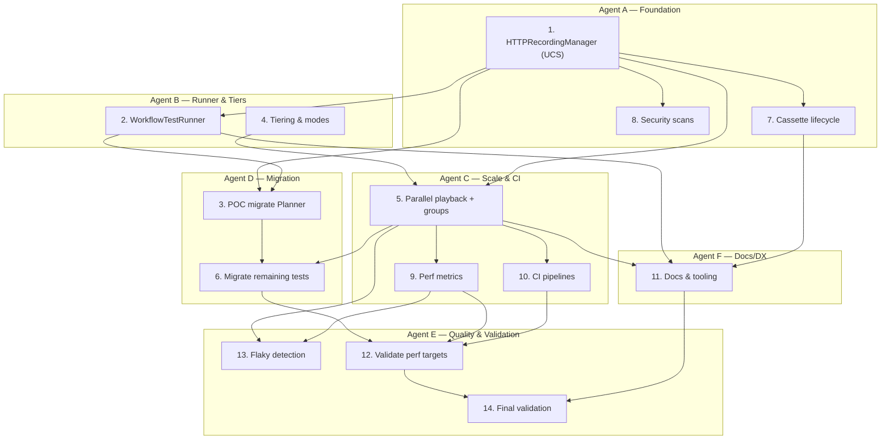

# Task Plan (LLM‑Orchestrated)

**Goal:** If all tasks complete, the system satisfies faster_sim.md (with two critical fixes already included here: serial recording enforcement and `requests` backend coverage). fileciteturn0file3

## Dependency‑validated Task List
Legend: ✅ sound | ⚠️ could start earlier | 🔒 hard gate

1. **HTTPRecordingManager + UCS foundation** — *Prereqs: none* — ✅  
   - Unified cassette format + sanitization + backend activation (responses/requests‑mock, respx, aioresponses). citeturn0search18turn0search3turn0search1turn0search2  
   - **Impose serial when recording** (disable xdist / exit if parallel). 🔒 fileciteturn0file2

2. **WorkflowTestRunner abstraction** — *Prereqs: 1* — ✅  
   - Continuation IDs, shared validators/fixtures, integration with Manager. fileciteturn0file1

3. **POC migration (PlannerValidationTest)** — *Prereqs: 1, 2* — ✅  
   - Prove UCS + runner end‑to‑end; record sanitized cassettes. fileciteturn0file0

4. **Tiering & execution modes** — *Prereqs: none* — ✅  
   - Markers: `tier1`,`tier2`,`tier3`,`quick`; register in `pytest.ini`. citeturn1search0

5. **Parallel playback + workflow continuity** — *Prereqs: 1, 4* — ✅  
   - pytest‑xdist; `--dist loadgroup` + `@pytest.mark.xdist_group` to keep workflows on one worker. citeturn0search0turn0search15  
   - Per‑worker storage + cassette paths; serial fallback. fileciteturn0file2

6. **Migrate remaining tests to UCS** — *Prereqs: 3, 5* — ⚠️  
   - Can begin after 3; full scale benefits once 5 lands. Preserve golden paths as Tier3. fileciteturn0file0

7. **Cassette lifecycle automation** — *Prereqs: 1* — ✅  
   - Staleness detection (hash), refresh scheduling, orphan cleanup. fileciteturn0file0

8. **Security scanning & CI gates** — *Prereqs: 1* — ✅  
   - Pre‑commit + CI enforcement against secrets; block on violations. fileciteturn0file0

9. **Performance metrics** — *Prereqs: 5* — ✅  
   - Durations, hit/miss, parallel efficiency. fileciteturn0file0

10. **CI pipelines (quick/pr/nightly)** — *Prereqs: 4, 5* — ✅  
    - Wire markers + parallel playback; Tier3 runs serially at tail. fileciteturn0file0

11. **Docs & DX tooling** — *Prereqs: 2, 5, 7* — ⚠️  
    - Rolling docs; finalize after 2/5/7 stabilize. fileciteturn0file0

12. **Validate performance targets** — *Prereqs: 6, 9, 10* — ✅  
    - Prove <10m full, <3m PR/quick; fix bottlenecks. fileciteturn0file0

13. **Flaky detection & quarantine** — *Prereqs: 5, 9* — ✅  
    - Multi‑run detection; quarantine harness. fileciteturn0file0

14. **Final end‑to‑end validation** — *Prereqs: all* — ✅  
    - Performance, coverage, security, and live‑spec gates green. fileciteturn0file0

## Parallelization Plan (for Multiple LLM Agents)

## Rationale for Key Prereqs
- **3 after 1&2:** POC relies on UCS + runner integration. ✅ fileciteturn0file0  
- **5 after 1&4:** Needs UCS paths and tier markers before grouping workers. ✅ fileciteturn0file0 citeturn0search0  
- **6 after 3&5:** Migration scales cleanly once parallel infra is ready. ⚠️ fileciteturn0file0  
- **Recording serialization:** Gate is enforced in Task 1 and used by Task 5. 🔒 fileciteturn0file2

## Work Modes (CLI contracts for agents)
- **quick:** run 6 curated tests; `pytest -m "quick" -n auto` (playback only). fileciteturn0file3  
- **pr:** Tier1+Tier2 in parallel playback; fail on unexpected live calls. fileciteturn0file2  
- **nightly:** All tiers; Tier3 runs serially at end.

## Done = Spec Met
Completing Tasks 1–14 with the two fixes (serial‑recording + requests backend) yields the exact system targeted by faster_sim.md (speed, tiers, determinism, preserved live spec, CI modes). fileciteturn0file3
